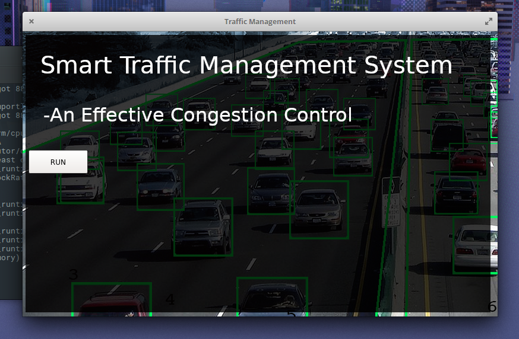

# DynamicTrafficSignal
A Dynamic Traffic Signal generator working on basis of vehicular lane density and assigns signal priority accordingly.

The Dynamic Traffic Signal Generator is an application which senses vehicular lane density and uses an algorithm to assign traffic priority based on a weighted threshold.

A Graphical UI is created as a prototype to test this.

